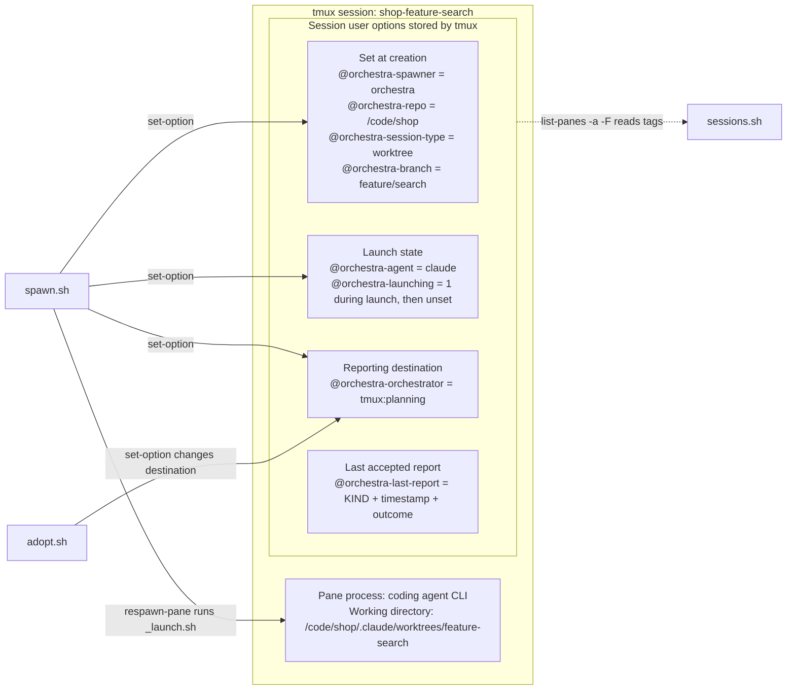

# Orchestra

Orchestra lets one coding agent delegate work to other coding agents. The **orchestrator** supervises the work; each **player** runs in a tmux session and works on a branch in a git worktree, or, as a **dir player**, in an existing directory with no branch or worktree (a reviewer, or work outside any repository). Players send progress, questions, and results back to the supervising agent.

Players run on the orchestrator's machine by default. With [beam](#machines) installed, `--machine` puts a player on another machine you have paired with, and its reports come back over the same pairing. Without beam nothing changes: the same commands, the same Git and tmux operations, the same output.

Orchestra provides two skills backed by Bash scripts. The skills tell the agents how to coordinate; the scripts perform the Git and tmux operations. Use Claude Code in tmux or a Codex desktop/CLI conversation as the orchestrator. You can attach to any player's session to inspect its work or talk to it directly.

[Install](#install) · [Start a task](#start-a-task) · [Architecture](#architecture) · [Machines](#machines) · [Scripts](#scripts) · [Reporting](#reporting) · [Resume and handoff](#resume-or-hand-off-a-player) · [Requirements](#requirements)

## Install

### Claude Code

```text
/plugin marketplace add notaharness/plugins
/plugin install orchestra@notaharness
```

The plugin provides `/orchestra:orchestrator` and `/orchestra:player`. Use the namespaced names to avoid conflicts with other installed skills.

### Codex and other agents

Install both skills with [Vercel's skills CLI](https://github.com/vercel-labs/skills)
(requires Node.js and npm):

```bash
npx skills@latest add notaharness/plugins --global --skill orchestrator player
```

Choose the agents you use when prompted. Global installation is recommended for
Codex because players run in fresh worktrees and need access to both skills.
To install directly for Codex:

```bash
npx skills@latest add notaharness/plugins --global --agent codex --skill orchestrator player
```

Start a new Codex session, then invoke `$orchestrator` or `$player`. Other agents
use their own skill invocation syntax. Install **both** skills in the same scope:
the orchestrator uses the player's reporting helpers. Both installation routes
use the same `SKILL.md` files and bundled scripts; Codex metadata lives beside
each skill in `agents/openai.yaml`.

Use one installation route per agent to avoid duplicates. Claude plugin users
should use the plugin route above; standalone Claude installations use
`/orchestrator` and `/player` instead of the plugin namespace. When launching or
adopting standalone Claude players, set `ORCHESTRA_CLAUDE_SKILL=/player` in the
orchestrator's environment. By default, Claude players use `/orchestra:player`
even when their orchestrator runs in Codex. Installer support
for an agent does not imply that Orchestra's session launch and reporting have
been tested with it; see [Requirements](#requirements) and [limitations](#environment-and-limitations).

Update the skills installed through the CLI with:

```bash
npx skills@latest update --global
```

This updates globally installed skills managed by the CLI. Claude plugin updates
are managed through Claude Code.

### Existing installations

If you used the former `codex/install.sh`, back up any customizations and remove
only its `orchestrator` and `player` directories from `~/.agents/skills` (or the
custom directory you supplied) before installing with the skills CLI. Those
copies contain instructions and script links tied to the manual installation.

### Local development

From this repository's root:

```bash
npx skills@latest add . --global --agent codex --skill orchestrator player
```

Rerun the local install after editing the source skills and start a new session.
The installer manages its own installed copies; this is not a live link to the
checkout.

## Start a task

For a Claude orchestrator, open Claude Code inside tmux. A Codex orchestrator can use a desktop or CLI conversation directly.

```text
/orchestra:orchestrator Add search to this repo. Give the task to an Opus player and have it open a draft PR.
/orchestra:orchestrator Show me the status of my players.
```

In Codex, use `$orchestrator` with the same task text. The orchestrator chooses a branch and starts a player, then receives its reports in the conversation. Each assignment should fit one branch and PR; the orchestrator can coordinate assignments across multiple repositories.

The spawn command prints the worktree (or directory) and tmux session name. To inspect a player yourself:

```bash
tmux attach -t '=SESSION_NAME'
```

Detach with **Ctrl+B, then D**. Ctrl+C interrupts the running agent.

## Architecture

### Skills guide the agents; scripts operate the sessions

| Component | Role |
| --- | --- |
| [Orchestrator skill](skills/orchestrator/SKILL.md) | Guides the supervising agent: divide the work, choose players, inspect progress, and respond to reports. |
| [Orchestrator scripts](skills/orchestrator/scripts/) | `spawn.sh`, `sessions.sh`, `screen.sh`, `send.sh`, `adopt.sh`, and `kill.sh` perform the requested Git and tmux operations. |
| [Player launcher](skills/orchestrator/scripts/_launch.sh) | Runs inside a player's pane, reads its assignment, and starts or resumes the selected agent CLI. |
| [Player skill](skills/player/SKILL.md) | Guides the coding agent: work in its assigned worktree and report progress, questions, blockers, and completion. |
| [Reporting script](skills/player/scripts/report.sh) | Reads the session's reporting target and sends the player's message to the supervising agent. |

The scripts share naming and discovery helpers in [`_lib.sh`](skills/orchestrator/scripts/_lib.sh) and tag definitions, tmux targeting, and reporting helpers in [`_routing.sh`](skills/player/scripts/_routing.sh). Both skills must be installed together because the orchestrator scripts source the player's routing helpers.

### Labels, identity, and supervision

Three separate values describe a player:

| Concern | Where it lives | Example |
| --- | --- | --- |
| Human-readable label | tmux session name | `shop-feature-search` |
| Repository and branch identity | `@orchestra-repo` and `@orchestra-branch` session options | `/code/shop` + `feature/search` |
| Current supervisor | `@orchestra-orchestrator` session option | `tmux:planning`, `claude:<session-id>` or `codex:<thread-id>` |

The session name is chosen at creation from the repository directory and branch, with `/`, `.` and `:` replaced by `-`. If any session already has that name, a numeric suffix is added: `shop-feature-search-2`, then `-3`, and so on. Scripts find the player through its tags, so the suffix does not change its identity.

A player must have a creator tag, a repository tag, and session type `worktree` or `dir`. A familiar-looking name alone does not make a session a player. The reporting target can change while the same player process and conversation keep running.

### State lives on the tmux session

The `@orchestra-*` tags are native tmux **session user options**: string values that the Bash scripts read and write with tmux commands. The diagram shows the actual option names and example values. `@orchestra-launching` exists during launch; `@orchestra-last-report` is set after a transport accepts a report.



### Launch and prompt transport

1. `spawn.sh` prepares the branch and worktree, creates a detached tmux session, and writes the session tags.
2. It loads the assignment through stdin into a named tmux paste buffer, `orchestra-prompt-<session>`, on the same server. This carries large prompts without using tmux's roughly 16 KiB command allowance.
3. `respawn-pane` starts `_launch.sh` inside the pane with `ORCHESTRA_SESSION`, `ORCHESTRA_SOCKET`, and the selected launch settings.
4. The launcher reads and deletes the buffer, adds the player-skill invocation, records the selected agent CLI, and starts it with that text as the CLI's initial prompt argument, which the CLI submits itself.

Nothing is typed into a starting CLI, but a dialog at Claude Code's startup still stops the task: the workspace-trust dialog's default answer is "No, exit". So every Claude launch first records the worktree as trusted in Claude's global config (`projects[<worktree>].hasTrustDialogAccepted` in `$CLAUDE_CONFIG_DIR/.claude.json`, else `~/.claude.json`, replaced atomically and only when missing; a trusted parent directory does not count for Claude), and passes `--strict-mcp-config`, so the repository's `.mcp.json` raises no "new MCP server found" dialog. Players therefore run without MCP servers.

Worktrees live under the main checkout in `.claude/worktrees/`, with `/` in the branch name replaced by `-`: branch `feature/search` uses `.claude/worktrees/feature-search`. The assignment travels in the temporary buffer; coordination metadata lives in session options. The player reads its reporting target from the session each time it reports.

If tmux refuses to launch a newly created pane, `spawn.sh` removes its placeholder session and keeps the worktree for a retry. If the agent CLI exits, the pane remains available for inspection.

Session options disappear when the tmux session ends. `kill.sh` stops the session and leaves its branch and worktree in place. The agent CLI manages its own conversation history, which resume uses to continue work.

## Machines

Every orchestrator script accepts `--machine NAME`, defaulting to `$ORCHESTRA_MACHINE`, else this
machine. `NAME` is a [beam](https://github.com/notaharness/beam) peer label, alias or peer id —
beam pairs your machines and carries streams and messages between them, and is the seam through
which a player can run somewhere other than its orchestrator. Omitting the flag, or the literal `local`, means this machine.

Naming a machine runs the same Git and tmux commands, with the same arguments, over
`beam exec <machine>` instead of locally. The `beam` binary is resolved in order:
`$ORCHESTRA_BEAM`, then `beam` on `PATH`. If a machine was named and neither resolves, the script
fails and says so — it never falls back to running here, which would create or
act on a player on the wrong machine.

- `--repo` on a remote machine must be absolute or start with `~/`. A relative path is refused
  rather than resolved against this machine's working directory.
- The plugin must be installed on the remote machine too, at the same path relative to `$HOME`
  as here (Claude Code's plugin cache, `~/.claude/plugins/cache/...`, on both). The player's
  launcher runs in the pane, on that machine, and a spawn stops before creating anything when
  it is not there.
- Session names are unique only *per machine*. Once more than one machine is registered, a bare
  name no longer identifies one player and `--machine` may be needed alongside it.
- Which tmux server a machine keeps its players on is asked of that machine, once per command,
  and every script shares the answer — a machine whose sockets live outside `/tmp` (a
  `TMUX_TMPDIR` of its own) needs no configuration here.
- `sessions.sh --all` lists this machine plus, when beam resolves and peers are registered, every
  peer's players — one listing call per machine, with a MACHINE column (`--json`: a `machine`
  field). With no beam or no peers, the output is unchanged.
- A player on another machine reports back over beam: its `@orchestra-orchestrator` tag holds
  `beam:<orchestrator peer id>/tmux:<session>` (or `claude:<session-id>`, `codex:<thread-id>`)
  instead of the bare local form.

### Receiving reports from another machine: `relay.sh`

A player on another machine hands its report to beam, which delivers it to this machine. Something
here has to put it in front of the orchestrator, and that is `relay.sh`:

```bash
skills/orchestrator/scripts/relay.sh            # deliver to the session it was started in
skills/orchestrator/scripts/relay.sh --allow tmux:planning
```

Started by a Claude session, "the session it was started in" is `claude:$CLAUDE_CODE_SESSION_ID`,
even inside tmux, where `$TMUX` can name a session that is not this one's; otherwise it is the tmux
session. A `claude:` target is looked up under `relay.sh`'s own `$CLAUDE_CONFIG_DIR` (else
`~/.claude`).

It subscribes to the `orchestra` topic on the local beam daemon's control socket (through `socat`,
or an `nc` with `-U`) and delivers each envelope through the same sequence, and the same
pane-ownership check, that a local report uses — a message that crossed a machine boundary is not
trusted any further than one that did not.

Two properties are deliberate. It acknowledges a message only *after* delivering it; a message it
cannot deliver is deferred with the reason, stays with beam (`beam msg queue --which refused`), and
is offered again when `relay.sh` resubscribes 30 seconds later (`ORCHESTRA_RELAY_RETRY`), rather
than being destroyed after the player was already told it had arrived. And the targets it may
deliver to come only from how it was started (the session it runs in, plus any `--allow`), never
from the envelope — otherwise any paired machine could paste into any session here that has an
agent at the prompt, including your own.

`relay.sh` exits when the beam daemon closes its connection; restart it after restarting beam.
Nothing is lost in between, since beam keeps every report that was not acknowledged.

N10 Desktop is itself the relay, so do not run `relay.sh` alongside it.

## Requirements

- Linux or macOS with Bash, Git, coreutils (`realpath`, `sha256sum`), and `ps`/`pgrep`. Tested on Linux.
- tmux 3.x; tested with 3.4.
- An authenticated `claude` or `codex` CLI for each type of player you want to run. Codex
  players need Codex CLI 0.157 or later for the default `gpt-6-sol` model; older versions reject it.
- `beam` only if you want players on other machines, plus `socat` or an `nc` with `-U` on the
  orchestrator's machine for `relay.sh`; see [Machines](#machines).
- `python3` to pre-accept Claude Code's workspace-trust dialog for new worktrees; without it Claude may ask on first launch.
- OpenBSD `nc` (for `-N -U`) or `socat` to deliver reports to a Claude Code orchestrator's inbox socket; without either, a tmux orchestrator gets them pasted into its pane and a `claude:<session-id>` orchestrator cannot be reached.
- util-linux `script` for automatic CLI detection during resume.

Gemini, Copilot, and OpenCode can also be launched, but have more limited resume support. The plugin uses each CLI's existing authentication and permissions.

## Models and effort

| Player | Default model | Default effort |
| --- | --- | --- |
| Claude Code | `opus` | `high` |
| Claude Code with `--model fable` | `fable` | `high` |
| Codex | `gpt-6-sol` | `medium` |
| Codex with another `gpt-6-*` model, such as `gpt-6-astra` | The supplied model | `medium` |
| Codex with another model | The supplied model | `high` |

`opus` is the recommended Claude model for all work; `fable` is available as an alternative.

Use `--model` and `--effort` to override these defaults. The scripts accept `low`, `medium`, `high`, `xhigh`, and `max`; the selected CLI determines which combinations are available. `--permission-mode` applies only to Claude Code.

Resume passes model and effort options only when you supply them. Codex otherwise uses its configured default model. Claude's restoration of model and effort has not been verified, so pass those options explicitly when you need a particular configuration.

## Scripts

The orchestrator uses the scripts in `skills/orchestrator/scripts/`. All accept `--repo PATH` to select a repository from elsewhere, and `--machine NAME` to act on a machine other than this one (see [Machines](#machines)).

| Command | Purpose |
| --- | --- |
| `sessions.sh --all` | List players across repositories with their session name, branch, agent, reporting target and last report; without `--all`, the players tagged for the current or `--repo` repository. Add `--json` for structured output or `--sample N` to compare activity over time. |
| `spawn.sh --branch B --prompt "Task"` | Create a worktree and tmux session, then start a player. Also accepts `--prompt-file FILE`. |
| `spawn.sh --dir PATH --prompt "Task"` | Start a dir player in an existing directory: no branch, no worktree, nothing written there. Takes no `--branch`, `--repo` or `--from`. |
| `screen.sh SESSION --history 200` | Read a player's pane. `--lines N` limits the visible output. |
| `send.sh SESSION "Message"` | Send guidance. Use `--raw` for menus, `--key` for a keypress, or `--type` to type text. |
| `adopt.sh SESSION` | Connect an idle player to the current orchestrator. Optional text gives it a new assignment. |
| `spawn.sh --branch B --resume` | Restart a stopped player in its existing worktree (`--dir PATH --resume` for a dir player). |
| `kill.sh SESSION` | Stop one player's tmux session. Its branch and worktree remain. |
| `relay.sh` | Deliver reports arriving from players on other machines into a local session. See [Machines](#machines). |

New branches start from the freshly fetched default branch. Use `--from REF` to choose another starting point, or `--dry-run` to preview a spawn without writes or fetching.

`SESSION` in these commands is either the player's branch (`feature/search`, resolved in the current or `--repo` repository, or uniquely across repositories when run outside one) or the exact tmux session name that `sessions.sh` and `spawn.sh` print. Nothing matches by prefix. A dir player has no branch, so it is addressed by its session name, `<directory>-dir` (`review-dir` for `~/code/review`), suffixed like any other label when taken; the `-dir` keeps a reviewer in `.claude/worktrees/fix-login` from being named like the branch `fix-login`.

### Dir players

`spawn.sh --dir PATH` starts a player in an existing directory, for work that belongs to no branch: a reviewer reading a checkout, or ad-hoc work such as tidying files. It is tagged `@orchestra-session-type dir`, with the resolved directory in `@orchestra-repo` (the directory need not be a repository) and no `@orchestra-branch`; reporting, `sessions.sh`, `screen.sh`, `send.sh`, `adopt.sh`, `kill.sh` and `--resume` work as for any player. `sessions.sh` shows it with an empty branch, and in a repository's own listing only when its directory is that repository's main checkout. Keep a dir player out of a directory another player is changing.

## Session tags

Read a session option directly with tmux:

```bash
tmux -u show-options -qv -t '=shop-feature-search:' @orchestra-agent
```

`sessions.sh` summarizes each player's branch, agent, reporting target, and last accepted report. Add `--json` for full values or `--all` to list players across repositories. The complete session schema is:

| Tag | Value |
| --- | --- |
| `@orchestra-spawner` | Program that created the session; `spawn.sh` writes `orchestra`. |
| `@orchestra-repo` | Absolute, symlink-resolved path of the main checkout; for a dir player, of its directory, which need not be a repository. |
| `@orchestra-session-type` | `worktree` or `dir` for a player. Sessions with other types, such as `shell` or `agent`, are outside player management. |
| `@orchestra-branch` | Worktree players only: the branch the session was spawned under, unsanitized (`feature/x`). |
| `@orchestra-orchestrator` | Reporting target: `claude:<session-id>`, `codex:<thread-id>` or `tmux:<session>`, or, when the orchestrator is on another machine, `beam:<orchestrator peer id>/` followed by one of those. Set by `spawn.sh`, replaced by `adopt.sh`. |
| `@orchestra-orchestrator-config` | For a local `claude:` target only: the orchestrator's Claude configuration directory, where `report.sh` finds the session. Written and removed together with `@orchestra-orchestrator`. |
| `@orchestra-agent` | Harness in the pane: `claude`, `codex`, `gemini`, `copilot`, `opencode` or `custom`. The launcher records what actually started. |
| `@orchestra-launching` | `1` only while the placeholder pane exists. |
| `@orchestra-claude-session` | Dir players running Claude: the id of the conversation the launcher started (`--session-id`), which `--resume` continues. |
| `@orchestra-last-report` | `<KIND> <ISO-8601 UTC timestamp> <outcome>`, the outcome being `delivered` (Codex queue, or beam delivered), `stored` (beam stored), `inbox`, `queue` or `paste`, of the last report a transport accepted. The third field was appended to the older two-field form, so a reader that splits on whitespace and takes the first two still gets the kind and the timestamp. |

The first four tags (three for a dir player) record the session's origin and are written at creation. Spawning or adopting a player sets its supervisor independently.

The pane receives `ORCHESTRA_SESSION` and `ORCHESTRA_SOCKET` so the launcher and reporting script can reach its session. Other `ORCHESTRA_*` variables supply launch settings such as CLI, model, effort, and player-skill invocation; see the [launcher header](skills/orchestrator/scripts/_launch.sh). A pane without the injected session variables can discover its session from its existing tmux environment.

## Reporting

The player calls `report.sh KIND "message"`. The script reads `@orchestra-orchestrator` on every call and sends `[player SESSION] KIND: message`, where `SESSION` is the player's tmux session name. `report.sh --orchestrator` prints the target; changing it is the responsibility of the spawn and adoption scripts.

Reports go to a Claude Code session addressed by its id, a Codex conversation through `codex queue`, or an orchestrator in a tmux pane, reached through `ORCHESTRA_SOCKET` (see [Delivery](#delivery)). An explicit `--orchestrator claude:<session-id>`, `codex:<thread-id>` or `tmux:<session>` selects the target when spawning or adopting. Otherwise, the scripts detect the orchestrator from the current session, in this order:

1. A Claude session (`CLAUDE_CODE_SESSION_ID`), as `claude:<session-id>`, even inside tmux. The id is checked against Claude's registry entry for `CLAUDE_PID`; a mismatch, or a session without an inbox socket, stops the script. This is the only address a Claude orchestrator outside tmux (a bare terminal, Claude Desktop) has, and it survives resume, compaction and renaming, where a tmux name is a guessable label.
2. A Codex conversation (`CODEX_THREAD_ID`), unless the caller is a Claude session.
3. The current tmux session.

A player's own Codex or Claude session ID is never used as its parent target.

Players send four kinds of report:

| Report | Meaning |
| --- | --- |
| `PROGRESS` | A meaningful milestone. |
| `QUESTION` | A decision that needs input. |
| `BLOCKED` | Something prevents further progress. |
| `DONE` | The task is complete, with results and any limitations. |

### Delivery

A message for an agent in a tmux pane — a report for a tmux orchestrator (`report.sh`, `relay.sh`), or a message and an adoption for a player (`send.sh`, `adopt.sh`) — takes the first route that pane can take, decided on every call from what is running in it:

| Route | When | What the agent sees |
| --- | --- | --- |
| Inbox | Claude Code 2.1.224 or later, with `nc` (with `-N -U`) or `socat` installed | The text arrives on the session's [inbox socket](https://code.claude.com/docs/en/cross-session-messaging#the-sessions-inbox-socket) as a cross-session message: read between tool calls while it works, a new turn while it is idle. Nothing is typed into its prompt box. |
| Queue | A Codex TUI that has had its first turn | `codex queue --thread <id>` hands it over as the conversation's next turn. |
| Paste | Anything else: another agent, an older Claude Code, a Codex TUI before its first turn, a pane on another machine | One bracketed paste, submitted with Enter. |

What each queue carries:

- **Claude's inbox carries text only.** Claude Code never runs a slash command or skill invocation that arrives there; it reaches the model as plain text from "another session". So `adopt.sh` always types `/orchestra:player …` into a Claude pane, and only `send.sh`'s `[orchestrator] …` messages and reports use the inbox.
- **Codex's queue carries skill mentions too.** A queued `$player …` loads the skill as a typed one does, so `adopt.sh` queues it for a Codex player.
- **Neither carries a fresh player's first task.** `spawn.sh` hands the task to the CLI as its initial prompt argument. A Codex conversation has no thread id to address until that first turn has started.
- `--raw`, `--key` and `--type` in `send.sh` are keystrokes for the TUI itself (menus, slash commands) and always go into the pane.

The Claude socket comes from the registry file Claude Code keeps for each live session, `sessions/<pid>.json` under that session's configuration directory, with its recorded start time and pid namespace checked against the process so a recycled pid is never mistaken for it. The Codex thread is the UUID of the rollout file the TUI holds open, `<CODEX_HOME>/sessions/…/rollout-…-<uuid>.jsonl`, skipping subagent threads; `codex queue` runs with that `CODEX_HOME`. Both lookups run only on the machine the scripts run on, so a pane on another machine is pasted. Once the inbox or the queue has been tried, a failure is final and nothing is pasted as well, which could deliver twice.

A `claude:<session-id>` orchestrator has no pane. `report.sh` scans the registry under the orchestrator's configuration directory (`@orchestra-orchestrator-config`, else the player's `$CLAUDE_CONFIG_DIR`, else `~/.claude`) for the live entry with that `sessionId` and posts to its inbox socket; Claude Desktop registers there the same way. No live entry, a stale one, or a refused socket is a delivery failure: nothing is ever pasted for a `claude:` target.

Successful delivery prints `queued for …` (a Codex orchestrator addressed as `codex:`) or `sent to <session|session-id> (inbox|queue|paste)`, and records the kind, the timestamp and the outcome — `delivered`, `stored`, `inbox`, `queue` or `paste` — in `@orchestra-last-report`. This confirms transport acceptance; it does not confirm that the supervising agent has read the report.

When the orchestrator is on another machine, delivery has three outcomes rather than two, and the
middle one is a success:

| Outcome | Exit | What the player is told |
| --- | --- | --- |
| Delivered | 0 | `sent to <peerId>`: the other machine's beam stored the report and acknowledged it. |
| Stored | 0 | beam's own sentence: the report is on this machine's disk, delivery is pending because that machine is offline or has not acknowledged it yet, and it must not be sent again. |
| Rejected | non-zero | The failure output below, with beam's reason (`unknown-peer`, `revoked-peer`, `payload-too-large`, …). |

Stored is a success because the report is on disk and beam keeps delivering it. It is stated in
those terms because the reader is usually a coding agent, which would otherwise conclude its
report was lost and either duplicate it or wait for an answer that cannot arrive yet.

A failed delivery exits nonzero and prints the destination, reason, and complete original report to stderr:

```text
report.sh: delivery failed
Target: tmux:planning
Reason: orchestrator session planning is gone or unreachable
Report: [player shop-feature-search] DONE: Search is implemented…
```

The player surfaces the failure and quotes the full report in its response. There is no automatic retry. If a paste succeeds but submission fails, inspect the destination before trying again to avoid duplicate messages. When a player appears finished but no report arrived, the supervising agent can inspect its pane with `screen.sh` and ask for the result.

## Resume or hand off a player

### Resume a stopped player

Resume restores a conversation in its existing worktree:

```bash
spawn.sh --repo PATH --branch feature/search --resume
spawn.sh --repo PATH --branch feature/search --resume --prompt "Next, add keyboard navigation."
```

The player receives a restart note and no task body; the reporting target tag is set again from the current orchestrator. You can supply a new message with `--prompt` or `--prompt-file`; the original task is not replayed.

The script chooses the CLI from `--agent`, then the session's `@orchestra-agent` tag. If neither is available, it tries Claude `--continue`. Only the specific no-conversation diagnostic triggers a fallback to the newest Codex conversation recorded for that worktree. Other errors stop the launch and leave a dead pane to inspect.

A dir player resumes with `spawn.sh --dir PATH --resume`. Its directory may hold other conversations, the orchestrator's own included, so a Claude dir player starts with a conversation id of the launcher's choosing, recorded in `@orchestra-claude-session`, and resumes exactly that conversation.

### Hand off a running player

Run `adopt.sh SESSION` to connect an existing player to the current supervising agent. The player must be idle at its input prompt. The script changes `@orchestra-orchestrator` and sends the player-skill invocation into the pane. The player continues in the same process, conversation, and worktree.

With no assignment text, the player reports its current task, completed work, remaining work, and questions; a finished player repeats its completion report. With assignment text, it takes on that task. Dead panes and bare shells cannot be adopted.

This example hands a player to the agent running in the `planning` tmux session:

```mermaid
sequenceDiagram
    participant Parent as Supervising agent in tmux:planning
    participant Adopt as adopt.sh
    participant Tags as Player's tmux session options
    participant Player as Running player agent
    participant Report as report.sh

    Parent->>Adopt: Run adopt.sh shop-feature-search
    Adopt->>Tags: set-option @orchestra-orchestrator tmux:planning
    Adopt->>Player: Send player-skill invocation
    Note over Player: Same agent process, conversation, and worktree

    Player->>Report: Run report.sh PROGRESS with handoff summary
    Report->>Tags: show-options @orchestra-orchestrator
    Tags-->>Report: tmux:planning
    Report->>Parent: Deliver on the planning session's Claude inbox socket, or paste and submit
    alt Transport accepts report
        Report->>Tags: set-option @orchestra-last-report to kind + timestamp + outcome
    else Delivery fails
        Report-->>Player: Exit nonzero; print target, reason, and full report to stderr
    end
```

## Recover after a crash

A power loss, reboot or dead tmux server removes every player session and its tags; Orchestra keeps no other record of its players. Resume the orchestrator's conversation instead: its history holds each spawn command, and the orchestrator skill's "Recovering after a crash" steps bring each player back with `spawn.sh --resume` under the account it was spawned with. Resume restores each conversation to its last saved message and keeps the worktree's files and commits; in-flight steps, background subagents and scheduled check-ins are lost. A Claude dir player cannot be resumed, because its conversation id lived in `@orchestra-claude-session`; spawn it fresh.

## Environment and limitations

A pane starts with the tmux server's environment, which is the orchestrator's only if the orchestrator started that server. A local player is therefore given the orchestrator's `PATH`, `HOME`, `CLAUDE_CONFIG_DIR` and `CODEX_HOME` explicitly (the last two unset when the orchestrator has them unset), so it runs on the same Claude and Codex accounts. Other configuration and authentication variables, such as `ANTHROPIC_API_KEY`, come from the tmux server's environment. Known parent-session markers are removed so the new CLI has its own session identity.

The launcher unsets `TMUX` and redirects `TMUX_TMPDIR` to a scratch directory to reduce accidental interaction with the user's tmux server. Reporting reaches the real server through `ORCHESTRA_SOCKET` and reads the target from the session tag. This environment setup is not a security boundary and does not grant access through a sandbox.

Known limitations:

- Sessions created by pre-release builds of orchestra (from the old `hermannbjorgvin` marketplace), which kept state in files and named sessions after a hash of the repository path, are not recognised; there are no compatibility shims. Kill or finish those players with the version that created them.
- The test suites use fake agent CLIs. They do not verify live model sessions or delivery from a real player through `codex queue`.
- A remote spawn is not covered end to end. The suites fake a second machine by isolating its
  `PATH`, `HOME` and tmux state, which catches an operation that acts locally while claiming to act
  remotely, but not a genuine second machine's filesystem or environment.
- The pre-flight check that an agent CLI exists is skipped for a remote spawn, because checking
  costs a round trip. A missing CLI on the remote machine fails at launch instead of before it.
- A report the `relay.sh` allowlist refuses is offered again whenever `relay.sh` resubscribes,
  which it does after any failed delivery, so it is refused and logged again each time. Clear it
  from beam's refused list, or start `relay.sh` with the `--allow` it needs.
- Codex resume finds conversations by the worktree path in rollout files; paths requiring JSON escaping do not match.
- `@orchestra-claude-session` ends with the session, so a Claude dir player removed with `kill.sh` cannot be resumed. A Codex dir player resumes the newest Codex conversation recorded for its directory, which may belong to another agent working there.
- OpenCode resume is untested. Gemini and Copilot resume are unsupported.
- Automatic CLI detection during resume keeps a `script` transcript in `/tmp` for the Claude session's lifetime.
- The pane check treats any non-shell foreground process as an agent, including an editor or pager.
- Host permissions still apply. The plugin does not change AppArmor or sandbox settings.

## Tests

Run from the repository root:

```bash
python3 orchestra/tests/test_port.py
bash orchestra/tests/smoke_tmux.sh
```

Both suites use temporary Git repositories and fake agent CLIs, without model calls. The Python suite mocks tmux, including exact targeting, command-size limits, session user options and paste buffers. The shell suite uses a real tmux server on an isolated socket and checks the tags there.
